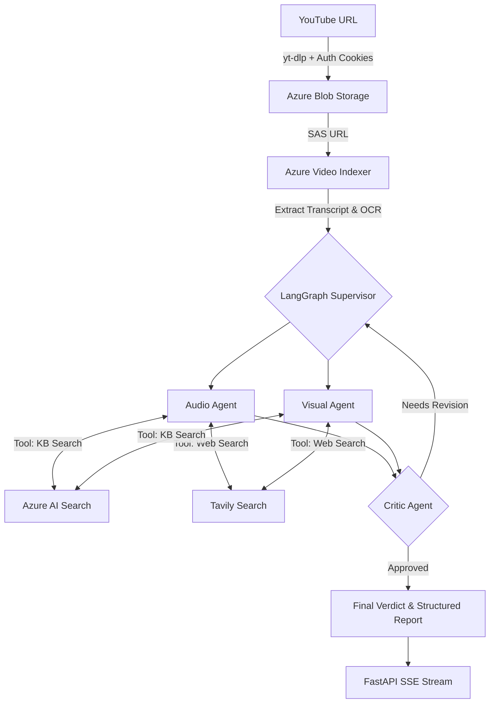

# Brand Guardian AI — Multimodal Compliance Ingestion Engine

**Live Demo:** [http://3.94.86.110:8000](http://3.94.86.110:8000)

A production-grade, multi-agent **multimodal compliance auditing pipeline** designed to automate the process of checking video content against brand and regulatory guidelines. The system ingests public YouTube videos, extracts multimodal signals (Transcript + OCR) using **Azure Video Indexer**, retrieves relevant policy guidance from **Azure AI Search**, and generates structured compliance verdicts using specialized LangGraph **Azure OpenAI Agents**.

---

## 🏗️ Architecture

The engine follows a highly parallel, agentic workflow using a **Supervisor-Worker-Critic** pattern:



---

## 🚀 Key Features

*   **Multi-Agent Orchestration**: Powered by **LangGraph**, featuring a Supervisor-Worker pattern with ReAct agents (Audio, Visual) and a specialized Critic agent for self-correction.
*   **Production Ingestion (v2.1)**: Utilizes an **Azure Blob Storage → SAS URL** workflow to securely and reliably upload massive video files to Azure Video Indexer without triggering HTTP timeouts.
*   **Self-Reflective Critic**: The Critic agent validates agent findings against original content and can trigger a "Revision Loop" if evidence or citations are missing.
*   **Real-time Observability**: Streams live agent "thought logs" to the frontend via **Server-Sent Events (SSE)**.
*   **Distributed Rate Limiting**: Integrates `slowapi` backed by **Redis** to safely throttle requests across multiple load-balanced API containers.
*   **Bot Detection Bypass**: Implements Netscape `cookies.txt` injection to successfully route downloads around YouTube's datacenter blocks.

---

## 🛠️ Technology Stack

*   **Backend**: FastAPI, Python 3.12, Uvicorn
*   **Orchestration**: LangGraph, LangChain
*   **AI Services**: Azure OpenAI (GPT-4o), Azure Video Indexer
*   **Vector Database**: Azure AI Search (Vector Store)
*   **Cloud Infrastructure**: AWS ECS (Fargate), Azure Blob Storage
*   **Tools**: Tavily Web Search, yt-dlp, FFmpeg
*   **Caching/Throttling**: Redis 7 (Alpine)

---

## 📖 Component Breakdown

### 1. Ingestion Worker (Indexer)
Downloads YouTube videos via `yt-dlp`, stages them in Azure Blob Storage, and submits them to Azure Video Indexer. It abstracts away the complexity of handling large file uploads and polling for multimodal insights.

### 2. Specialist Agents
- **Audio Agent**: Processes the video transcript. It uses ReAct loops to search the Azure Knowledge Base for regulatory rules and issues structured findings (FTC disclosures, brand tone, etc.).
- **Visual Agent**: Processes on-screen text (OCR). It identifies unauthorised logos, misleading visual claims, and missing legal caveats.

### 3. Critic Agent
Acts as the final quality gate. It deduplicates issues, verifies citations, and ensures the "Final Report" is concise and accurate. It can send agents back to work if the analysis is insufficient.

---

## 📦 Local Setup

1.  **Clone & Install**:
    ```bash
    git clone <repo-url>
    cd Azure-MultiModal-Compilance-Ingestion-Engine
    uv sync  # or pip install -e .
    ```

2.  **Environment Setup**:
    Configure your `.env` with Azure, Tavily, and AWS credentials (see `.env.example`).

3.  **Run with Docker Compose**:
    ```bash
    docker compose up --build
    ```
    Access the interactive dashboard at `http://localhost:8000`.

---

## ☁️ Deployment

The project is optimized for **AWS ECS (Fargate)**. A robust deployment script is provided:

```bash
# Deploys Cluster, Task Definition, and Service to AWS
./deploy_aws.sh --region us-east-1
```

**Infrastructure includes:**
- **ECR**: Private Docker registry.
- **Fargate**: Serverless execution of the API and Redis workers.
- **CloudWatch**: Centralised logging for agent activity.
- **VPC**: Isolated networking with public-facing ALB or direct IP access.

---

## 🔐 Security & Governance

*   **SAS Tokens**: Azure storage access is limited to short-lived Shared Access Signatures.
*   **Non-Root Execution**: Container processes run as restricted users (UID 1000).
*   **Secret Management**: Sensitive keys are injected via environment variables (supporting AWS Secrets Manager).

---

## 🎯 Usage

**Endpoint:** `POST /api/audit`
**Payload:**
```json
{
  "video_url": "https://www.youtube.com/watch?v=EXAMPLE_ID"
}
```

**Response (SSE Stream):**
Live logs are streamed via `GET /api/audit/{session_id}/stream`, followed by the final compliance report.
