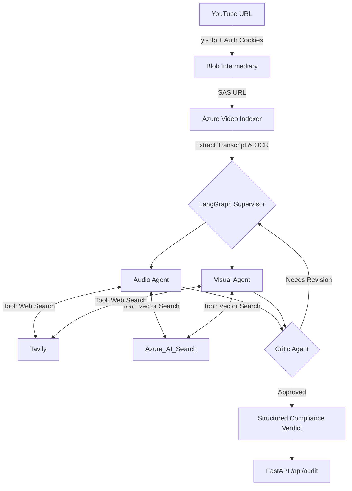

# Azure MultiModal Compliance Ingestion Engine (Brand Guardian AI)

**Live Demo URL:** [http://brand--Publi-yJqYe8QyIkCq-528690479.ap-south-1.elb.amazonaws.com](http://brand--Publi-yJqYe8QyIkCq-528690479.ap-south-1.elb.amazonaws.com)

A production-grade, multi-agent **multimodal compliance auditing pipeline** designed to automate the process of checking video content against brand and regulatory guidelines. The system ingests public YouTube videos, extracts multimodal signals (Transcript + OCR) using **Azure Video Indexer**, retrieves relevant policy guidance from **Azure AI Search**, and generates structured compliance verdicts using specialized LangGraph **Azure OpenAI Agents**.

---

## 🚀 Key Features

*   **Multi-Agent Orchestration**: Powered by LangGraph, featuring a Supervisor-Worker pattern with ReAct agents (Audio, Visual) and a specialized Critic agent for self-correction.
*   **Production Ingestion (v2.1)**: Utilizes an **Azure Blob Storage → SAS URL** workflow to securely and reliably upload massive video files to Azure Video Indexer without triggering HTTP timeouts.
*   **Real-time Observability**: Streams live agent logs to the frontend via Server-Sent Events (SSE).
*   **Distributed Rate Limiting**: Integrates `slowapi` backed by an internal **Redis** container to safely throttle requests across multiple load-balanced API containers.
*   **YouTube Bot Bypass**: Implements Netscape `cookies.txt` injection to successfully route downloads around YouTube's "Sign in to confirm" data-center blockades.
*   **AWS ECS Native**: Built from the ground up for instantaneous deployment to AWS Fargate via the AWS Copilot CLI.

---

## 🏗️ Architecture

The engine follows a highly parallel, agentic workflow:



---

## 🛠️ Technology Stack

*   **Backend Framework**: FastAPI, Uvicorn, Python 3.12-slim
*   **Agentic Orchestration**: LangGraph, LangChain
*   **AI & Cloud Services**: Azure OpenAI (GPT-4o), Azure Video Indexer, Azure AI Search, Azure Blob Storage
*   **Search Tools**: Tavily Web Search
*   **Deployment & Infrastructure**: Docker (multi-stage), AWS ECS (Fargate), AWS Application Load Balancer, AWS Copilot CLI, Redis

---

## 📦 Local Setup & Docker Compose

To test the multi-container architecture locally before deploying to the cloud:

1.  **Clone the Repository**:
    ```bash
    git clone <repo-url>
    cd Azure-MultiModal-Compilance-Ingestion-Engine
    ```

2.  **Environment Setup**:
    Create a `.env` file referencing the needed Azure Endpoints, Search Keys, and Tavily Keys (see `.env.example`).
    Make sure to export your browser's YouTube session into `ComplianceQAPipeline/cookies.txt`.

3.  **Spin up with Docker Compose**:
    ```bash
    docker compose up --build
    ```
    This automatically boots the Redis Cache backend and the FastAPI server. Access the dashboard at `http://localhost:8000`.

---

## ☁️ AWS ECS Deployment (The Easy Way)

This application is configured for one-click deployment to **AWS ECS (Fargate)** using the [AWS Copilot CLI](https://aws.github.io/copilot-cli/).

### 1. Initialize the Infrastructure
```bash
copilot app init brand-guardian
copilot env init --name dev --default-config
copilot env deploy --name dev
```

### 2. Configure Internal Redis
Launch the rate-limiting Redis backend directly into your secure VPC subnets:
```bash
copilot svc init --name redis --svc-type "Backend Service" --dockerfile ./redis_svc/Dockerfile
copilot svc deploy --name redis --env dev
```

### 3. Inject Secrets Securely
Never hardcode credentials or commit them to source control. Inject your `.env` variables and your YouTube Cookies safely to AWS Systems Manager (SSM) Parameter Store:
```bash
# Example
copilot secret init --name TAVILY_API_KEY --values dev="<your-key>"

# Inject your cookies file as Base64 to avoid mounting local volumes
export B64_COOKIES=$(base64 -w 0 ComplianceQAPipeline/cookies.txt)
copilot secret init --name YOUTUBE_COOKIES_B64 --values dev="$B64_COOKIES"
```
*(The provided Docker `entrypoint.sh` automatically decodes the `YOUTUBE_COOKIES_B64` secret before the server boots).*

### 4. Deploy the API
```bash
copilot svc init --name api --svc-type "Load Balanced Web Service" --dockerfile ./Dockerfile
copilot svc deploy --name api --env dev
```
AWS Copilot will output your final public Application Load Balancer URL.

---

## 📖 Usage

### API Endpoints
*   **Health Check**: `GET /api/health`
*   **Run Audit**: `POST /api/audit`
    ```json
    { "video_url": "https://www.youtube.com/watch?v=example" }
    ```
*   **Stream Live Logs (SSE)**: `GET /api/audit/{session_id}/stream`

### Frontend Dashboard
You can monitor pipeline states in real-time by visiting the `/` root domain of your hosted application. The interactive terminal dynamically streams Supervisor and Critic Agent reasonings as they occur.

---

## 🔐 Security & Operations

*   **Data Privacy**: Videos pushed via SAS URLs to Video Indexer follow Azure's enterprise privacy boundaries.
*   **Stability**: Large uploads are chunked directly to Blob Storage first, circumventing Video Indexer's direct-HTTP reset limits.
*   **Rate Limits**: Endpoint traffic is strictly regulated via SlowAPI, backed synchronously across replicas using the Copilot Redis Backend.
