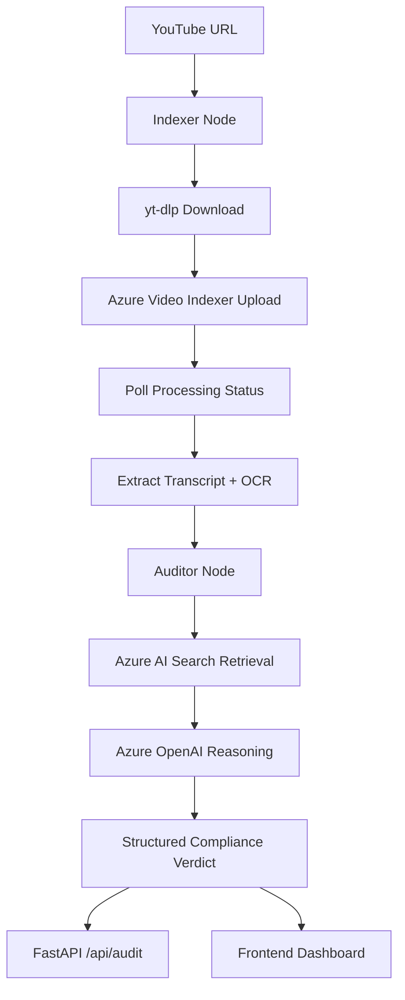

# Azure MultiModal Compliance Ingestion Engine (Brand Guardian AI)

A production-grade **multimodal compliance auditing pipeline** designed to automate the process of checking video content against brand and regulatory guidelines. The system ingests public YouTube videos, extracts multimodal signals (Transcript + OCR) using **Azure Video Indexer**, retrieves relevant policy guidance from **Azure AI Search**, and generates structured compliance verdicts using **Azure OpenAI**.

---

## 🚀 Key Features

*   **Multimodal Analysis**: Combines transcript (audio) and OCR (visual text) for a holistic compliance check.
*   **RAG-Powered Auditing**: Dynamically retrieves the latest policy documents from a vectorized knowledge base.
*   **Orchestration with LangGraph**: Uses a stateful graph to manage the indexing and auditing lifecycle.
*   **Enterprise Observability**:
    *   **LangSmith**: Deep tracing of LLM calls and graph execution flows.
    *   **OpenTelemetry**: Automatic instrumentation for API requests and Azure service dependencies via Azure Monitor.
*   **Scalable Backend**: Built with FastAPI for high-performance asynchronous operations.

---

## 🏗️ Architecture

The engine follows a linear stateful workflow managed by **LangGraph**:



---

## 🛠️ Technology Stack

*   **Logic**: Python 3.12+
*   **Framework**: FastAPI, LangGraph, LangChain
*   **AI Services**: Azure OpenAI (GPT-4o), Azure Video Indexer, Azure AI Search
*   **Observability**: LangSmith, OpenTelemetry (Azure Monitor)
*   **Infrastructure**: Docker, Railway / Azure Web Apps

---

## 📋 Configuration & Environment Variables

Create a `.env` file in the root directory with the following configuration:

### 1. General & API
```bash
APP_ENV=development
LOG_LEVEL=INFO
ALLOWED_ORIGINS=http://localhost:8000
```

### 2. Azure OpenAI
```bash
AZURE_OPENAI_ENDPOINT=https://your-resource.openai.azure.com/
AZURE_OPENAI_API_KEY=your-api-key
AZURE_OPENAI_API_VERSION=2024-12-01-preview
AZURE_OPENAI_CHAT_DEPLOYMENT=gpt-4o
AZURE_OPENAI_EMBEDDING_DEPLOYMENT=text-embedding-3-small
```

### 3. Azure AI Search
```bash
AZURE_SEARCH_ENDPOINT=https://your-search-service.search.windows.net
AZURE_SEARCH_API_KEY=your-search-api-key
AZURE_SEARCH_INDEX_NAME=brand-guidelines-index
```

### 4. Azure Video Indexer & Storage
```bash
AZURE_VI_ACCOUNT_ID=your-vi-account-id
AZURE_VI_LOCATION=trial # or your region
AZURE_SUBSCRIPTION_ID=your-sub-id
AZURE_RESOURCE_GROUP=your-rg
AZURE_VI_NAME=your-vi-resource-name
AZURE_STORAGE_CONNECTION_STRING="DefaultEndpointsProtocol=https;AccountName=..."
```

### 5. LangSmith (LLM Tracing)
Enable LangSmith to visualize the LangGraph execution and LLM prompts.
```bash
LANGCHAIN_TRACING_V2=true
LANGCHAIN_ENDPOINT="https://api.smith.langchain.com"
LANGCHAIN_API_KEY="your-langsmith-api-key"
LANGCHAIN_PROJECT="brand-guardian-ai"
```

### 6. OpenTelemetry (Azure Monitor)
Required for tracking API performance, failures, and Azure service dependencies.
```bash
APPLICATIONINSIGHTS_CONNECTION_STRING="InstrumentationKey=your-key;IngestionEndpoint=..."
```

---

## 🔍 Observability Deep Dive

### 🟢 LangSmith Integration
This project uses **LangSmith** for granular tracing of the AI agents. Every run through the `Auditor Node` is tracked, allowing you to:
*   Inspect the exact prompt sent to Azure OpenAI.
*   View the retrieved policy chunks from Azure AI Search.
*   Debug JSON parsing issues or "hallucinations" in the compliance verdict.
*   Monitor token usage and latency per node.

> [!TIP]
> Access your traces at [smith.langchain.com](https://smith.langchain.com).

### 🔵 OpenTelemetry & Azure Monitor
The `ComplianceQAPipeline/backend/src/api/telemetry.py` module initializes the **Azure Monitor OpenTelemetry Distro**.
*   **Auto-instrumentation**: Automatically hooks into FastAPI to capture request/response data.
*   **Dependency Tracking**: Tracks calls to external services like Azure OpenAI and Azure Search.
*   **Logs Integration**: Synergizes standard Python `logging` with Azure Monitor logs for centralized viewing in Application Insights.

Run the setup in your API entry point:
```python
from ComplianceQAPipeline.backend.src.api.telemetry import setup_telemetry
setup_telemetry()
```

---

## 🚀 Local Setup

1.  **Clone and Install**:
    ```bash
    git clone <repo-url>
    cd Azure-MultiModal-Compilance-Ingestion-Engine
    pip install -e .
    ```

2.  **Environment Setup**:
    Populate the `.env` file as shown in the [Configuration](#-configuration--environment-variables) section.

3.  **Index Policy Documents**:
    Upload your PDF brand guidelines to Azure AI Search.
    ```bash
    python ComplianceQAPipeline/backend/scripts/index_documents.py
    ```

4.  **Run the Backend**:
    ```bash
    uvicorn ComplianceQAPipeline.backend.src.api.server:app --host 0.0.0.0 --port 8000 --reload
    ```

---

## 📖 Usage

### CLI Simulation
Run a quick test of the pipeline directly from the terminal:
```bash
python ComplianceQAPipeline/main.py
```

### API Endpoints
*   **Health Check**: `GET /api/health`
*   **Run Audit**: `POST /api/audit`
    ```json
    {
      "video_url": "https://www.youtube.com/watch?v=example"
    }
    ```

### Frontend Dashboard
Access the built-in UI at `http://localhost:8000` to submit audits and view real-time compliance reports.

---

## 📂 Repository Layout

```text
.
├── README.md
├── pyproject.toml
└── ComplianceQAPipeline/
    ├── main.py              # CLI Simulation Entry Point
    ├── backend/
    │   └── src/
    │       ├── api/         # FastAPI Server & Telemetry
    │       ├── graph/       # LangGraph Workflow (Nodes, State)
    │       └── services/    # Azure Video Indexer & Search logic
    └── frontend/            # HTML/JS Dashboard
```

---

## 🔐 Security & Compliance

*   **Data Privacy**: Videos processed by Video Indexer follow Azure's enterprise privacy standards.
*   **Secrets**: Use environment variables; never commit API keys.
*   **Human-in-the-loop**: AI verdicts should be used as a decision-support tool, not as a final legal judgment.

---

## 🗺️ Roadmap

- [ ] Support for local video file uploads.
- [ ] Integration with Microsoft Teams/Slack for audit alerts.
- [ ] Custom fine-tuned models for industry-specific compliance (e.g., Pharma, Finance).
- [ ] Multi-user authentication and audit history.


